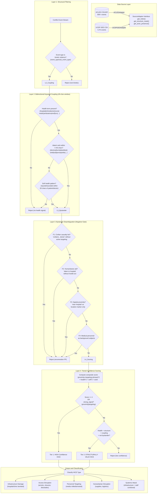

# HICE Pipeline Mermaid Diagram

Save as `research/assets/hice_pipeline.mmd`

```mermaid
graph TD
    subgraph Input["Data Source Layer"]
        direction LR
        ACLED[("ACLED CSV/API\n80K+ events")]
        UCDP[("UCDP GED CSV\n5.7K events")]
        ACLED -->|ACLEDAdapter| Adapter["SourceAdapter Interface\n.get_notes()\n.get_structure_mask()\n.get_actor_presence()"]
        UCDP -->|UCDPGEDAdapter| Adapter
    end

    subgraph Layer1["Layer 1: Structural Filtering"]
        L1_Start["Conflict Event Stream"] --> L1_Decision{"Event type is\nkinetic violence?\n(event_type/sub_event_type)"}
        L1_Decision -->|Yes| L2_Coupling
        L1_Decision -->|No| L1_Reject["Reject (non-kinetic)"]
    end

    subgraph Layer2["Layer 2: Bidirectional Keyword Coupling (45-char window)"]
        L2_Coupling --> L2_Health{"Health term present?\n(hospital|clinic|doctor|nurse|\nmedic|ambulance|msf|icrc|...)"}
        L2_Health -->|No| L2_Reject["Reject (no health signal)"]
        L2_Health -->|Yes| L2_Action{"Attack verb within\n<=45 chars?\n(destroy|burn|attack|loot|\nshell|raid|arrest|strike|...)"}
        L2_Action -->|No| L2_Soft{"Soft health pattern?\n(injured/wounded within\n20 chars of patient/doctor)"}
        L2_Action -->|Yes| L3_Bystander
        L2_Soft -->|No| L2_Reject
        L2_Soft -->|Yes| L3_Bystander
    end

    subgraph Layer3["Layer 3: Bystander Disambiguation (Negative Gate)"]
        L3_Bystander --> F1{"F1: Civilian casualty list?\n'civilians...doctor' without\nactive targeting"}
        F1 -->|Yes| L3_Reject["Reject (enumeration FP)"]
        F1 -->|No| F2{"F2: Humanitarian aid?\n'taken to hospital'\nwithout hostile act"}
        F2 -->|Yes| L3_Reject
        F2 -->|No| F3{"F3: Spatial proximity?\n'near hospital' as\nlocation marker only"}
        F3 -->|Yes| L3_Reject
        F3 -->|No| F4{"F4: Medical personnel\nas background subjects"}
        F4 -->|Yes| L3_Reject
        F4 -->|No| L4_Scoring
    end

    subgraph Layer4["Layer 4: Tiered Confidence Scoring"]
        L4_Scoring --> Score["Compute composite score:\n(proximity+targeting+phrase)*2\n+ health*2 + soft*2 + actor"]
        Score --> Tier1{"Score >= 4\nOR\nstrong_signal?\n(proximity|targeting)"}
        Tier1 -->|Yes| Tier1_HICE["Tier 1: HIGH Confidence HICE"]
        Tier1 -->|No| Tier2{"Health + structure\n+ coupling\n+ not bystander?"}
        Tier2 -->|Yes| Tier2_HICE["Tier 2: STRUCTURALLY VALID HICE"]
        Tier2 -->|No| Reject["Reject (low confidence)"]
    end

    subgraph Output["Output and Classification"]
        Tier1_HICE --> Classify[Classify HICE Type]
        Tier2_HICE --> Classify
        Classify --> Infra["Infrastructure Damage\n(hospital/clinic bombed)"]
        Classify --> Access["Access Disruption\n(arrests, closures, blockades)"]
        Classify --> Personnel["Personnel Targeting\n(medics killed/arrested)"]
        Classify --> Humanitarian["Humanitarian Disruption\n(supplies, logistics)"]
        Classify --> Systemic["Systemic Attack\n(infrastructure + staff combined)"]
    end
```
