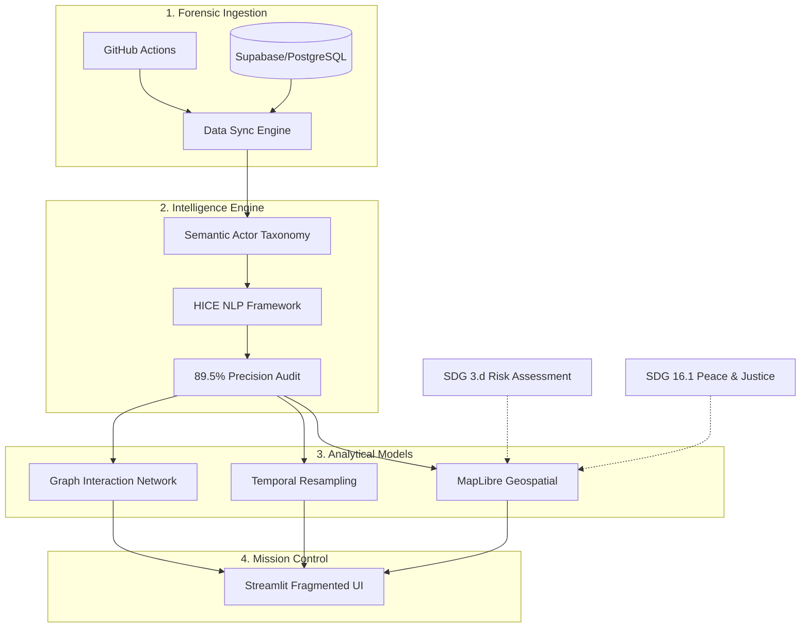

[မြန်မာဘာသာဖြင့် ဖတ်ရန်](docs/myanmar_translation.md)

# Myanmar Conflict Observatory (MCO)

[](https://www.kaggle.com/datasets/tainyantun/acled-dataset-for-myanmar)
[](https://github.com/TainYanTun/Myanmar-conflict-observatory)
[](https://tainyantun-myanmar-conflict-observatory-app-mafeff.streamlit.app/)

The **Myanmar Conflict Observatory (MCO)** is an enterprise-grade analytical framework and geospatial intelligence hub dedicated to monitoring the spatiotemporal dynamics of political violence in Myanmar. 

Since the military takeover on February 1, 2021, Myanmar has transitioned into a protracted state of asymmetric warfare. This platform transforms over 100,000 raw ACLED event logs into high-fidelity humanitarian insights, specifically optimized for **UN Sustainable Development Goal (SDG) 3.d monitoring**.

## The "Verified Floor" Mandate
This observatory operates under a conservative data verification protocol. We treat ACLED data as a **"Verified Floor"**—the absolute minimum confirmed human cost. In regions under communication blackouts, actual figures are likely significantly higher. Our mission is to provide an objective, evidence-based record of conflict expansion and infrastructure vulnerability.

## Key Features & High-Tech Architecture

### 1. HICE Intelligence Engine (NLP)
*   **Automated Detection**: A multi-layered rule-based NLP pipeline identifying **Health-Impacting Conflict Events (HICE)**. [See System Logic & Diagrams](docs/HICE_System_Logic.md).
*   **Research-Grade Validation**: Achieved **89.5% Precision** and a **252.3% increase in visibility** over standard structured dataset tags.
*   **Hidden Toll Extraction**: Decodes qualitative event narratives to uncover the "Nature of Violence" (e.g., hospital arson, medic targeting) absent from formal tags.

### 2. Geospatial Risk Modeling
*   **Dynamic Animation**: High-performance WebGL-based temporal expansion maps showing the ruralization of conflict into Myanmar's heartland.
*   **Regional Risk Matrix**: A quadrant-based analysis (Frequency vs. Lethality) that identifies high-intensity **"Red Zones"** requiring immediate trauma-focused humanitarian intervention.
*   **Tactical Obfuscation**: Implements "Do No Harm" standards by centroiding incident coordinates to prevent the tactical targeting of medical assets.

### 3. Performance & UI Standard
*   **Isolated Reruns**: Optimized with `st.fragment` architecture, allowing for instantaneous interactions in the Spotlight Explorer and Records tab without full-page reloads.
*   **Cyber-Forensic UI**: A custom-designed dark-mode interface with glassmorphic components, standard Plotly layout systems, and a high-tech forensic initialization console.
*   **Big Data Optimization**: Pre-calculated display indices and server-side data slicing for seamless handling of 100k+ records.

## System Architecture



## Setup & Installation

The MCO utilizes a hybrid cloud architecture (ACLED API + Supabase PostgreSQL).

1. **Register with ACLED:** Obtain an account at [acleddata.com](https://acleddata.com/).
2. **Configure Environment:** Create a `.env` file in the root directory:
   ```env
   ACLED_EMAIL=your_email@example.com
   ACLED_PASSWORD=your_password
   RESEND_API_KEY=your_key_for_contact_form
   ```
3. **Initialize Data:**
   ```bash
   python update_data.py
   ```
4. **Launch Dashboard:**
   ```bash
   streamlit run app.py
   ```

## Ethical Framework & Data Governance
*   **Institutional Neutrality**: Independent, non-partisan research. NLP ontologies use cross-verified humanitarian dictionaries to ensure narrative neutrality.
*   **ICRC Alignment**: Data presentation adheres to the *ICRC Handbook on Data Protection in Humanitarian Action*.
*   **Human Rights Documentation**: High-resolution (3x) export capabilities support the use of visualizations for accountability and legal advocacy.

## Collaborators
- **Tain Yan Tun** - Full Stack Data Engineer & Lead Researcher
- **Kyaw Zay Aung** - Data Analyst & Conflict Specialist

## License
This project is licensed under the [MIT License](LICENSE). 
Information on political violence and protest events is sourced from the [Armed Conflict Location & Event Data Project (ACLED)](https://acleddata.com/).

---
*For technical details on the HICE framework, refer to the formal research manuscript in* `research/main.tex`.
