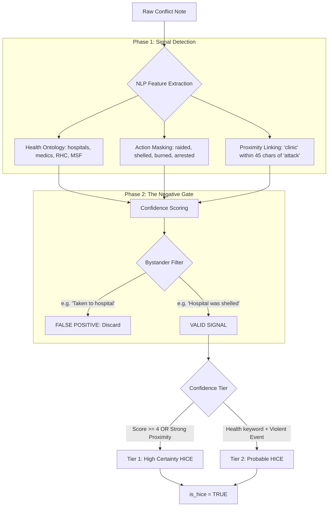
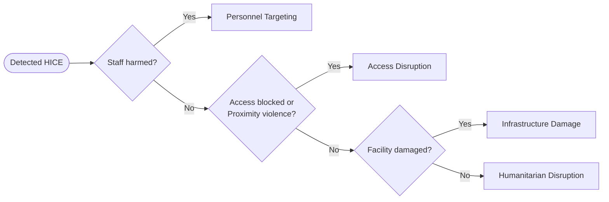

# HICE Framework: NLP Intelligence & Classification Logic

This document provides a technical overview of how the **Health-Impact-Conflict-Event (HICE)** engine identifies and classifies incidents impacting the healthcare system in Myanmar.

---

## 1. The NLP Intelligence Pipeline
The system uses a multi-stage NLP pipeline to distinguish between direct attacks on health infrastructure and "noise" (incidents where health facilities are mentioned incidentally).

### Key Technical Mechanisms:
*   **Bidirectional Proximity:** The `proximity_pattern` in `src/processing.py` scans for a health term and an attack term within a 45-character window.
*   **The Negative Gate (`fp_mask`):** Specifically filters out narratives where patients are simply "transported" or "admitted" to a hospital following a non-HICE event.
*   **Confidence Scoring:** Boosts the score if multiple indicators (proximity + action phrases + structured actor tags) overlap.

---

## 2. HICE Classification Taxonomy
Once an event is flagged as `is_hice`, it is routed into one of five research categories based on prioritized keyword triggers.

| Category | Priority | Key NLP Trigger | Impact Description |
| :--- | :---: | :--- | :--- |
| **Personnel Targeting** | 1 | `killed`, `arrested` + `doctor`, `nurse`, `medic` | Direct violence or detention of healthcare workers. |
| **Access Disruption** | 2 | `closed`, `blocked` OR `proximity violence` | Barriers to care, forced closures, or danger-based denial of service. |
| **Infrastructure Damage** | 3 | `hospital`, `clinic`, `pharmacy` + `burned`, `shelled` | Physical destruction or looting of medical facilities. |
| **Systemic Attack** | 4 | `Infra Damage` + `Personnel Targeting` | Multi-vector attacks destroying both the facility and its staff. |
| **Humanitarian Disruption** | 5 | `General Health Signal` | Broad disruption to medical supply chains or healthcare delivery. |

---

## 3. Decision Logic Flow
The classification follows a "waterfall" logic to ensure the most severe or specific impact is captured.

---

## 4. Analytical Impact
The resulting `hice_type` and `is_hice` flags are used to calculate the **Vulnerability Score**:
> **Vulnerability Score** = `(0.7 * HICE_Count) + (0.3 * Fatalities)`

This score prioritizes regions where the healthcare infrastructure is being systematically degraded, providing a more nuanced view of conflict impact than fatalities alone.
