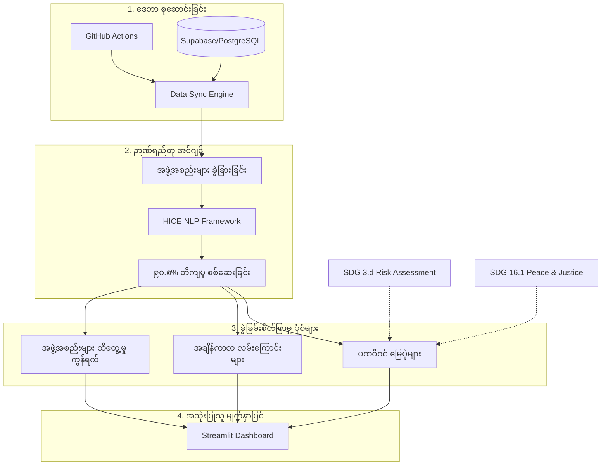

[Read in English](../README.md)

# မြန်မာ ပဋိပက္ခ စောင့်ကြည့်လေ့လာရေးအဖွဲ့ (Myanmar Conflict Observatory - MCO)

[](https://www.kaggle.com/datasets/tainyantun/acled-dataset-for-myanmar)
[](https://github.com/TainYanTun/Myanmar-conflict-observatory)
[](https://tainyantun-myanmar-conflict-observatory-app-mafeff.streamlit.app/)

**မြန်မာ ပဋိပက္ခ စောင့်ကြည့်လေ့လာရေးအဖွဲ့ (MCO)** သည် မြန်မာနိုင်ငံအတွင်း ဖြစ်ပွားနေသော နိုင်ငံရေး အကြမ်းဖက်မှု ဖြစ်စဉ်များကို အချိန်နှင့် တပြေးညီ ပထဝီဝင်ဆိုင်ရာ ခွဲခြမ်းစိတ်ဖြာပေးသည့် အဆင့်မြင့် နည်းပညာသုံး သုတေသန မူဘောင်တစ်ခု ဖြစ်သည်။

၂၀၂၁ ခုနှစ် ဖေဖော်ဝါရီ ၁ ရက် အာဏာသိမ်းမှု နောက်ပိုင်းတွင် မြန်မာနိုင်ငံသည် ရှုပ်ထွေးသော ပြည်တွင်းစစ် အသွင်ကူးပြောင်းသွားခဲ့သည်။ ဤစနစ်သည် ACLED မှ ရရှိသော ဖြစ်စဉ်ပေါင်း **၈ သောင်းကျော် (80,000+)** ကို **ကုလသမဂ္ဂ စဉ်ဆက်မပြတ် ဖွံ့ဖြိုးတိုးတက်ရေး ရည်မှန်းချက် (SDG) ၃.ဃ** အောင်မြင်စေရန် အထောက်အကူပြုမည့် လူသားချင်းစာနာမှု ဆိုင်ရာ အချက်အလက်များအဖြစ် ပြောင်းလဲပေးသည်။

> [!IMPORTANT]
> ### အတည်ပြုပြီး အခြေခံ အနိမ့်ဆုံး ကိန်းဂဏန်း (The "Verified Floor" Mandate)
> ဤစောင့်ကြည့်ရေးအဖွဲ့သည် ဒေတာများကို အထူးသတိထား အတည်ပြုသည့် စနစ်ကို အသုံးပြုသည်။ ကျွန်ုပ်တို့သည် ACLED ဒေတာများကို **"Verified Floor" (အတည်ပြုပြီး အခြေခံ အနိမ့်ဆုံး ကိန်းဂဏန်း)** အဖြစ်သာ သတ်မှတ်သည်။ အင်တာနက်နှင့် ဆက်သွယ်ရေး ဖြတ်တောက်ခံထားရသော ဒေသများတွင် အမှန်တကယ် ဖြစ်ပွားမှုနှုန်းမှာ ဤကိန်းဂဏန်းများထက် များစွာ ပိုမိုမြင့်မားနိုင်ပါသည်။ ကျွန်ုပ်တို့၏ ရည်မှန်းချက်မှာ ပဋိပက္ခ ပျံ့နှံ့မှုနှင့် ကျန်းမာရေး အခြေခံအဆောက်အအုံများ၏ ထိခိုက်လွယ်မှုကို အချက်အလက် ခိုင်ခိုင်လုံလုံဖြင့် မှတ်တမ်းတင်ရန် ဖြစ်သည်။

### ၁။ HICE နည်းပညာသုံး ဉာဏ်ရည်တု အင်ဂျင် (NLP)
*   **အလိုအလျောက် ထောက်လှမ်းခြင်း**: ကျန်းမာရေးကဏ္ဍကို ထိခိုက်စေသော ပဋိပက္ခဖြစ်စဉ်များ (**Health-Impacting Conflict Events - HICE**) ကို Rule-based NLP pipeline ဖြင့် အလိုအလျောက် ခွဲခြားပေးသည်။
*   **သုတေသနအဆင့် တိကျမှု**: ဖြစ်စဉ်များကို ခွဲခြားရာတွင် **၉၀.၈% တိကျမှု (Precision)** ရှိပြီး၊ ပုံမှန် ဒေတာစနစ်များထက် ကျန်းမာရေးနှင့် ဆက်စပ်သော ဖြစ်စဉ်များကို **၂၇.၈% ပိုမို မြင်သာအောင်** (Standard tags များထက် ဖြစ်စဉ် ၁၁၆ ခု ပိုမို) ဖော်ထုတ်ပေးနိုင်သည်။

### ၂။ ပထဝီဝင်ဆိုင်ရာ အန္တရာယ် ပုံဖော်ခြင်း (Geospatial Risk Modeling)
*   **အချိန်နှင့်အမျှ ပြောင်းလဲမှုများ**: WebGL နည်းပညာသုံး မြေပုံများဖြင့် မြန်မာနိုင်ငံအလယ်ပိုင်းသို့ ပဋိပက္ခများ ပျံ့နှံ့လာမှုကို animated စနစ်ဖြင့် ပြသပေးသည်။
*   **Regional Risk Matrix**: ဖြစ်စဉ် အကြိမ်အရေအတွက်နှင့် သေဆုံးမှုနှုန်းကို တွဲဖက်၍ လူသားချင်းစာနာမှု အကူအညီများ အရေးတကြီး လိုအပ်နေသည့် **"Red Zones"** ကို ခွဲခြားသတ်မှတ်ပေးသည်။
*   **Vulnerability Score**: ကျန်းမာရေး အခြေခံအဆောက်အအုံ ထိခိုက်မှုနှင့် သေဆုံးမှုနှုန်းကို ပေါင်းစပ်ထားသော `(0.7 * HICE Count) + (0.3 * Fatalities)` ပုံသေနည်းဖြင့် အန္တရာယ်ရှိသော ဒေသများကို ဦးစားပေး သတ်မှတ်သည်။

### ၃။ စနစ်၏ နည်းပညာများ (Core Tech Stack)
*   **Frontend & UI**: **Streamlit** ဖြင့် တည်ဆောက်ထားသော Dashboard နှင့် `st.fragment` စနစ်ကို အသုံးပြုထားသည်။
*   **Backend & Data**: **Supabase (PostgreSQL)** ဖြင့် ဒေတာ သိမ်းဆည်းခြင်းနှင့် **GitHub Actions** ဖြင့် နေ့စဉ် အလိုအလျောက် ဒေတာ ရယူခြင်းတို့ကို အသုံးပြုထားသည်။

## စနစ် တည်ဆောက်ပုံ (System Architecture)



## တပ်ဆင် အသုံးပြုပုံ (Setup & Installation)

၁။ **ACLED အကောင့်ဖွင့်ခြင်း**: [acleddata.com](https://acleddata.com/) တွင် အကောင့်ပြုလုပ်ပါ။
၂။ **ပတ်ဝန်းကျင် ပြင်ဆင်ခြင်း**: `.env` file တစ်ခုပြုလုပ်၍ အောက်ပါ အချက်အလက်များ ထည့်ပါ။
   ```env
   ACLED_EMAIL=သင်၏အီးမေးလ်
   ACLED_PASSWORD=သင်၏စကားဝှက်
   RESEND_API_KEY=contact_form_အတွက်_key
   ```
၃။ **ဒေတာ ရယူခြင်း**:
   ```bash
   python update_data.py
   ```
၄။ **Dashboard ကို စတင်ခြင်း**:
   ```bash
   streamlit run app.py
   ```

## ကျင့်ဝတ်ဆိုင်ရာ မူဘောင်နှင့် ဒေတာ စီမံခန့်ခွဲမှု (Ethical Framework)
*   **ဘက်မလိုက်သော သုတေသန**: မည်သည့် နိုင်ငံရေး သို့မဟုတ် စစ်ရေး အဖွဲ့အစည်းနှင့်မျှ ဆက်စပ်မှု မရှိသော လွတ်လပ်သော သုတေသန ဖြစ်သည်။
*   **လူသားချင်းစာနာမှု မူဝါဒ**: ဒေတာ တင်ပြမှုများသည် *ICRC Handbook on Data Protection* လမ်းညွှန်ချက်များနှင့် ကိုက်ညီပါသည်။
*   **တာဝန်ယူမှု မှတ်တမ်း**: အဆင့်မြင့် visualization များကို သုတေသနနှင့် တရားဥပဒေဆိုင်ရာ အထောက်အထားများအတွက် အသုံးပြုနိုင်ရန် high-resolution (3x) ဖြင့် ထုတ်ယူနိုင်သည်။

## ပူးပေါင်းဆောင်ရွက်သူများ (Collaborators)
- **Tain Yan Tun** — Lead Full Stack Engineer & Computational Data Scientist
- **Kyaw Zay Aung** — Data Analyst & Conflict Specialist

---
*HICE မူဘောင်၏ နည်းပညာပိုင်းဆိုင်ရာ အသေးစိတ်များကို* `research/main.tex` *ရှိ သုတေသန စာတမ်းတွင် ဖတ်ရှုနိုင်ပါသည်။*
